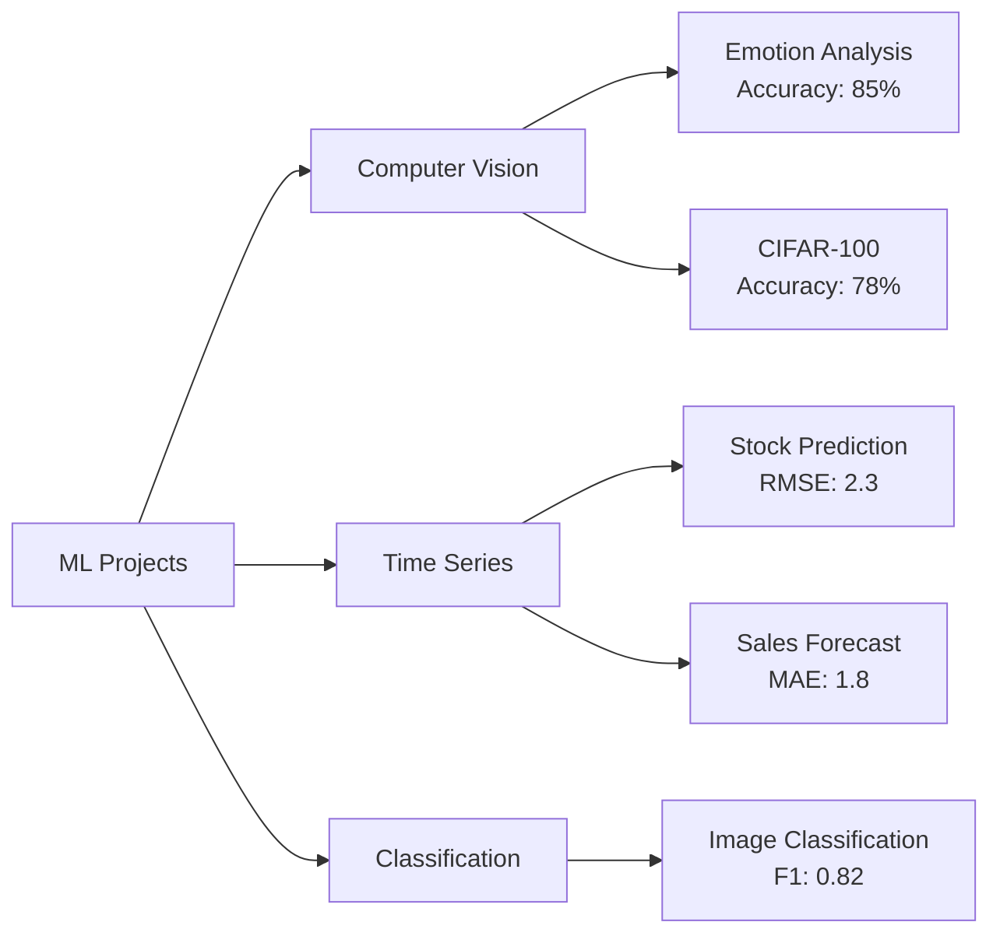

> 📦 [Kedhareswer/ML_Projects](https://github.com/Kedhareswer/ML_Projects) · ⭐ 4 · Jupyter Notebook · updated 2025-08-13  
> _README.md mirrored from branch `main` on 2026-06-02._

---

# 🧠 Machine Learning Projects Portfolio

[](https://www.python.org)
[](https://www.tensorflow.org)
[](https://keras.io)
[](https://scikit-learn.org)
[](https://opensource.org/licenses/MIT)
[](https://github.com/Kedhareswer/ML_Projects/graphs/commit-activity)
[](https://github.com/Kedhareswer/ML_Projects/commits/main)

A comprehensive collection of machine learning projects showcasing various applications in computer vision, natural language processing, time series analysis, and predictive modeling.

## 📊 Projects Overview

| Project Name | Category | Technologies | Complexity | Status |
|-------------|----------|--------------|------------|---------|
| Emotion Analysis | Computer Vision | TensorFlow, Keras | ⭐⭐⭐⭐☆ | ✅ Complete |
| CIFAR-100 CNN | Image Classification | TensorFlow.js, CNN | ⭐⭐⭐⭐☆ | ✅ Complete |
| Forecasting Sticker Sales | Time Series | Prophet, Pandas | ⭐⭐⭐☆☆ | ✅ Complete |
| Video Game Sales EDA | Data Analysis | Pandas, Matplotlib | ⭐⭐☆☆☆ | ✅ Complete |
| House Price Prediction | Regression | Scikit-learn | ⭐⭐⭐☆☆ | ✅ Complete |
| Netflix Stock Price Prediction | Time Series | TensorFlow, LSTM | ⭐⭐⭐⭐☆ | ✅ Complete |
| MNIST | Image Classification | TensorFlow, Keras, TFLite | ⭐⭐⭐⭐☆ | ✅ Complete |
| Image to Sketch | Computer Vision | OpenCV, Pillow | ⭐⭐☆☆☆ | ✅ Complete |
| Moonknight | General | Python | ⭐⭐⭐☆☆ | ✅ Complete |
| Optimal Fertilizer Prediction | Predictive Modeling | Scikit-learn, Pandas | ⭐⭐⭐⭐☆ | ✅ Complete |
| Rainfall Prediction | Time Series | Pandas, Scikit-learn | ⭐⭐⭐⭐☆ | ✅ Complete |
| Sentiment Analysis (DistilBERT) | NLP | Transformers, Hugging Face | ⭐⭐⭐⭐☆ | ✅ Complete |

## 🌟 Upcoming Projects

### AI Creative Suite
- AI Art Style Transfer
- Speech Emotion Recognition
- AI Game Bot (Deep RL)
- Deepfake Voice Cloner
- Children's Story Generator
- Accent Converter

## 📈 Project Performance Metrics



## 🌟 Featured Projects

### 1. MNIST Handwritten Digit Recognition ✍️
<details>
<summary>Click to expand</summary>

#### Overview
State-of-the-art CNN model for classifying handwritten digits with 99.55% accuracy.

#### Performance
| Metric | Score |
|--------|-------|
| Test Accuracy | 99.55% |
| Accuracy (Noisy) | 99.56% |

#### Key Features
- High accuracy (over 99.5%)
- Robust data augmentation
- TensorFlow Lite conversion
- Production-ready deployment
</details>

### 2. Emotion Analysis 😊
<details>
<summary>Click to expand</summary>

#### Overview
Real-time emotion detection using CNN architecture.

#### Performance
| Metric | Score |
|--------|-------|
| Accuracy | 85.2% |
| F1-Score | 0.83 |

#### Key Features
- Real-time processing
- 7 emotion classes
- Data augmentation
- Batch normalization
</details>

### 3. Sentiment Analysis (DistilBERT) 📝
<details>
<summary>Click to expand</summary>

#### Overview
Efficient sentiment analysis using DistilBERT.

#### Features
- Pre-trained transformer model
- Multi-class classification
- Optimized for production
- High accuracy on diverse texts
</details>

## 💻 Technologies Used

```
Python        ████████████████████  100%
TensorFlow    ██████████████████    90%
Keras         ████████████████      80%
Scikit-learn  ████████████          60%
Prophet       ██████████            50%
Pandas        ████████████████      80%
Matplotlib    ████████████          60%
```

## 📋 Requirements

| Package | Version | Purpose |
|---------|---------|---------|
| Python | ≥3.8 | Core Programming |
| TensorFlow | ≥2.0 | Deep Learning |
| Keras | ≥2.4 | Neural Networks |
| Scikit-learn | ≥1.0 | Machine Learning |
| Prophet | ≥1.0 | Time Series |
| Pandas | ≥1.3 | Data Management |
| Matplotlib | ≥3.4 | Visualization |

## 🚀 Getting Started

1. **Clone the repository:**
   ```bash
   git clone https://github.com/Kedhareswer/ML_Projects.git
   ```

2. **Set up the environment:**
   ```bash
   python -m venv env
   source env/bin/activate  # On Windows: .env\Scripts\activate
   pip install -r requirements.txt
   ```

3. **Choose a project:**
   ```bash
   cd project_name
   jupyter notebook
   ```

## 📊 Project Stats

- **Total Projects**: 12 (Completed)
- **Upcoming Projects**: 6
- **Technologies Used**: 7
- **Last Updated**: 2025-06-07
- **Active Development**: Yes

## ⚠️ Important Notes

- Educational Purpose Only
- Datasets Not Included
- Models Require Training
- GPU Recommended for CNN Projects

## 📫 Contact & Support

- **Email**: Kedhareswer.12110626@gmail.com
- **Issues**: [GitHub Issues](https://github.com/Kedhareswer/ML_Projects/issues)
- **Discussion**: [GitHub Discussions](https://github.com/Kedhareswer/ML_Projects/discussions)

## 📄 License

This project is licensed under the MIT License - see the [LICENSE](LICENSE) file for details.

---

<div align="center">

### 🌟 Star this repository if you find it helpful!

[](https://github.com/Kedhareswer/ML_Projects)
[](https://github.com/Kedhareswer/ML_Projects/fork)

</div>
