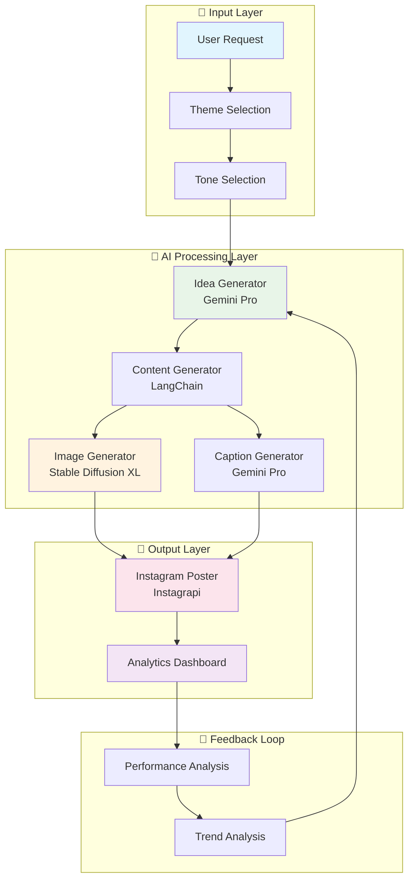
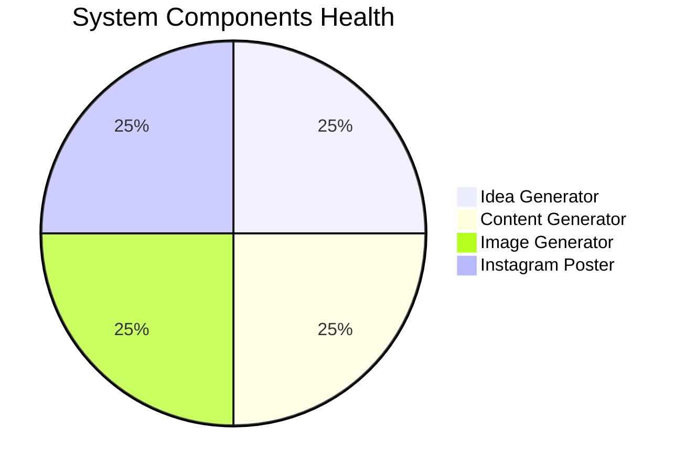
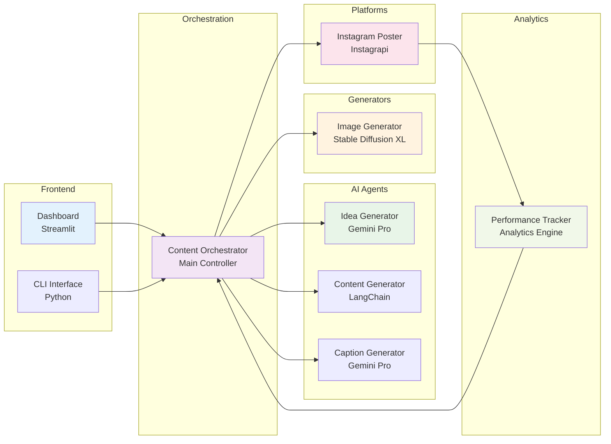
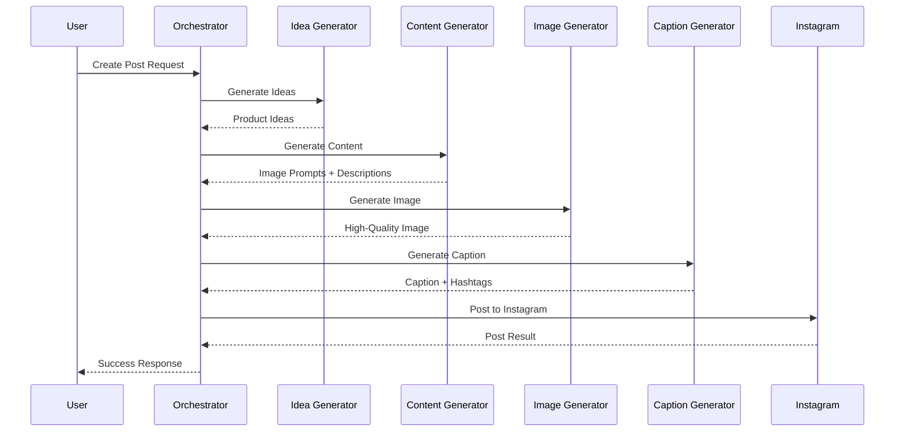
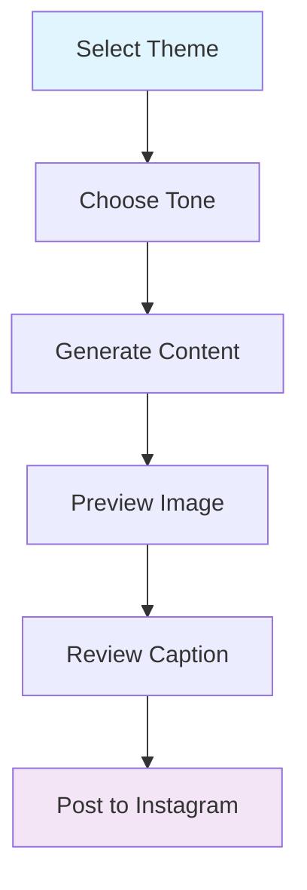
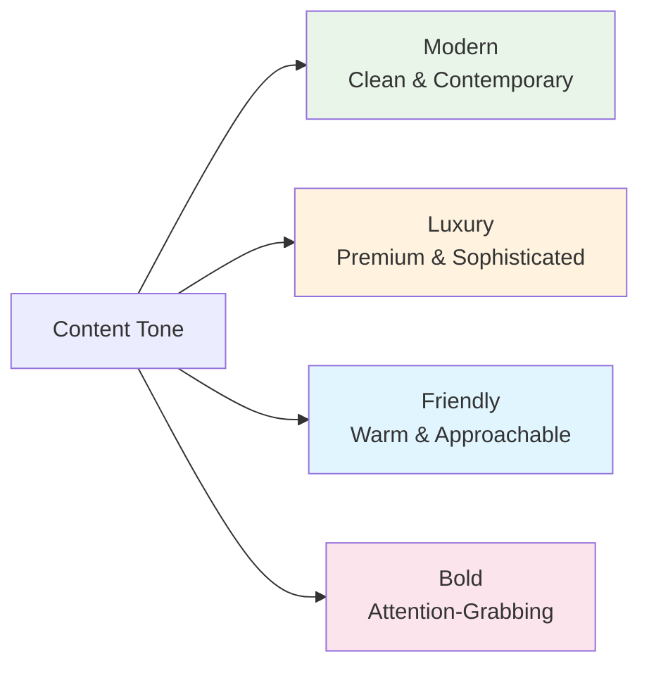
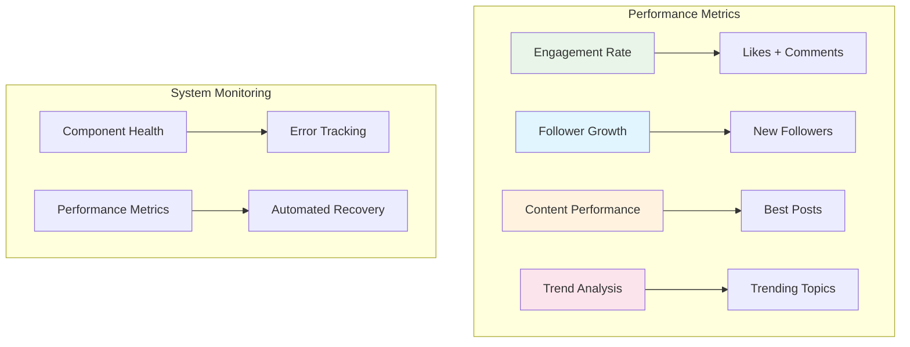
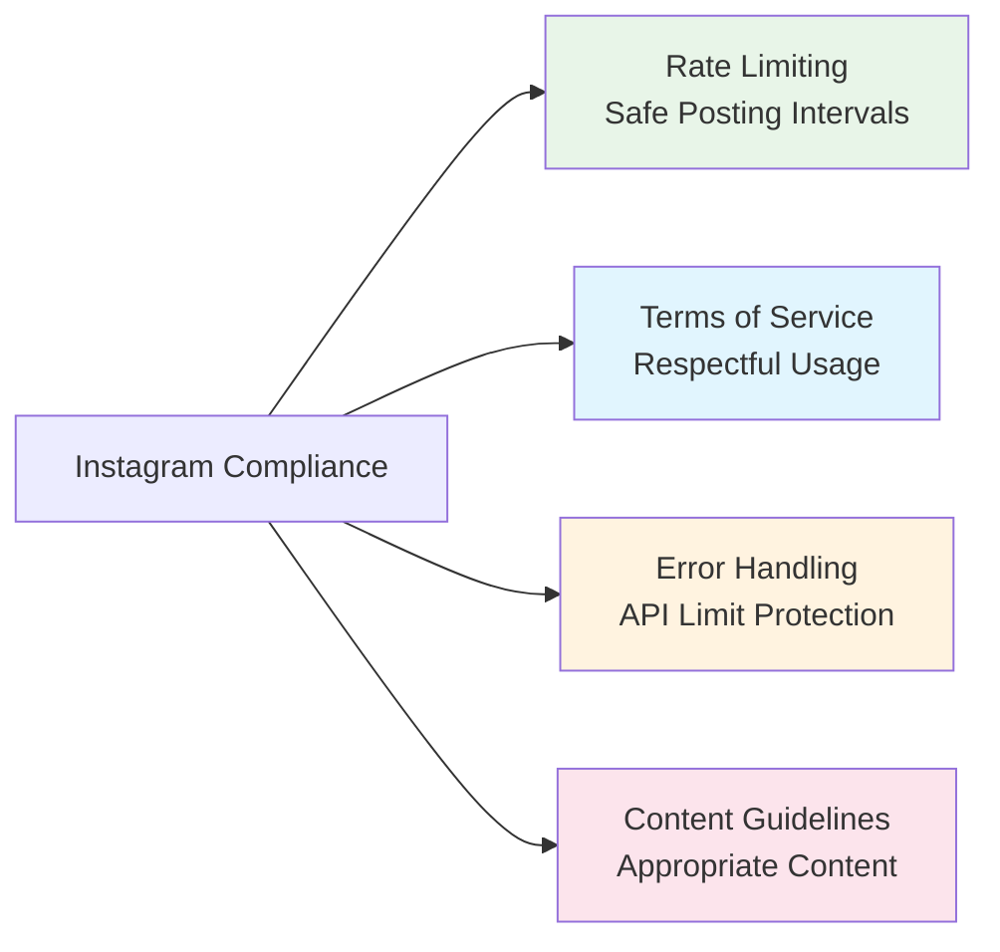
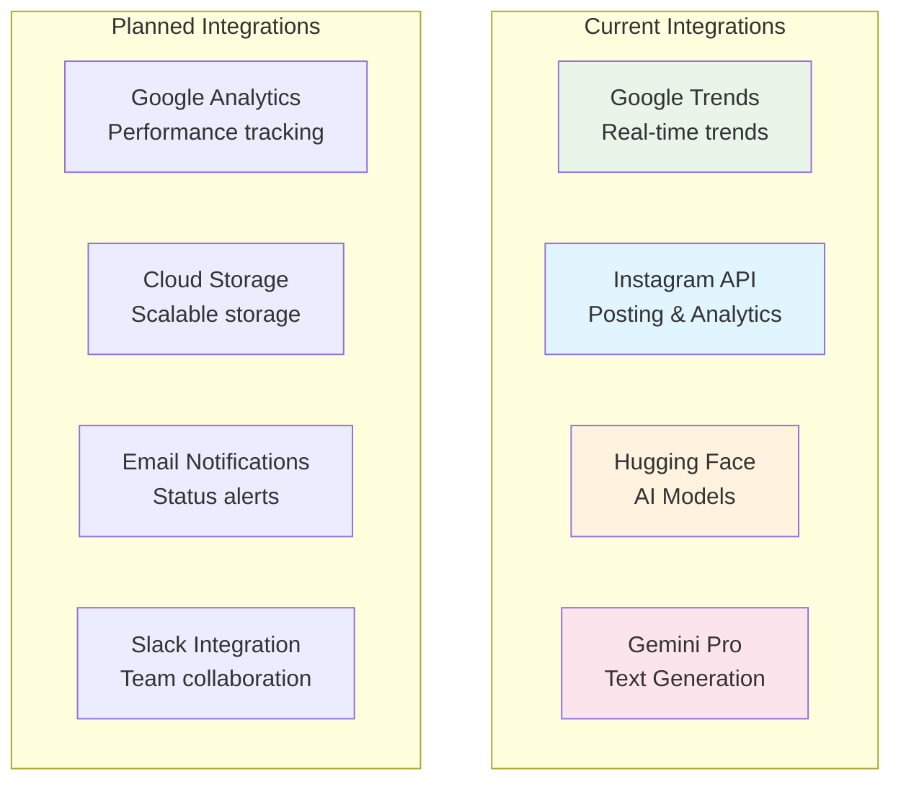
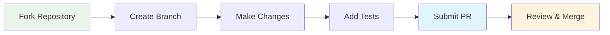

> 📦 [Kedhareswer/social_media_influencer](https://github.com/Kedhareswer/social_media_influencer) · ⭐ 0 · Python · updated 2025-07-30  
> _README.md mirrored from branch `main` on 2026-06-02._

---

# 🎯 Instagram Content Automation System

<div align="center">


[](https://opensource.org/licenses/MIT)
[](http://makeapullrequest.com)
[](https://github.com/your-repo/issues)

**A powerful, fully autonomous content creation and Instagram posting system** powered by **LangChain, Gemini, Hugging Face**, and **Stable Diffusion** — **without OpenAI APIs**.

[🚀 Quick Start](#-quick-start) • [📊 Features](#-features) • [🏗️ Architecture](#️-system-architecture) • [📱 Dashboard](#-dashboard-features) • [🛠️ CLI](#️-cli-commands)

</div>

---

## 📊 System Overview



## ✨ Features

### 🤖 **AI-Powered Content Generation**

<div align="center">

| Feature | Technology | Capability |
|---------|------------|------------|
| 🧠 **Idea Generation** | Gemini Pro | AI-driven product ideas and trending themes |
| 📝 **Content Creation** | LangChain | Automated prompts, descriptions, and marketing copy |
| 🎨 **Image Generation** | Stable Diffusion XL | High-quality Instagram images (1080x1080) |
| 📱 **Caption & Hashtags** | Gemini Pro | Engaging captions with performance-driven hashtags |
| 📤 **Auto-Posting** | Instagrapi | Seamless posting to Instagram |

</div>

### 📊 **Analytics & Monitoring**



### 🎨 **Content Customization Matrix**

| Theme | Modern | Luxury | Friendly | Bold |
|-------|--------|--------|----------|------|
| **Skincare** | ✅ | ✅ | ✅ | ✅ |
| **Beauty** | ✅ | ✅ | ✅ | ✅ |
| **Wellness** | ✅ | ✅ | ✅ | ✅ |
| **Fashion** | ✅ | ✅ | ✅ | ✅ |
| **Lifestyle** | ✅ | ✅ | ✅ | ✅ |

## 🏗️ System Architecture

### **🔧 Component Architecture**



### **🔄 Workflow Process**



## 🚀 Quick Start

### **📋 Prerequisites**

<div align="center">

| Requirement | Version | Status |
|-------------|---------|--------|
| Python | 3.8+ | ✅ Required |
| Google API Key | Gemini Pro | ✅ Required |
| Instagram Account | Business/Personal | ✅ Required |
| GPU (Optional) | CUDA Compatible | ⚡ Recommended |

</div>

### **⚡ 5-Minute Setup**

```bash
# 1️⃣ Clone & Install
git clone <repository-url>
cd Social_Media_Influencer
pip install -r requirements.txt

# 2️⃣ Configure API Keys
cp env_example.txt .env
# Edit .env with your API keys

# 3️⃣ Test System
python test_system.py

# 4️⃣ Launch Dashboard
python main.py --dashboard
```

### **🔑 API Configuration**

```yaml
# Required APIs
GOOGLE_API_KEY: "your-gemini-api-key"
INSTAGRAM_USERNAME: "your-instagram-username"
INSTAGRAM_PASSWORD: "your-instagram-password"

# Optional APIs
HUGGINGFACE_API_TOKEN: "your-hf-token"
REPLICATE_API_TOKEN: "your-replicate-token"
```

## 📱 Dashboard Features

### **🏠 Dashboard Overview**

<div align="center">

| Metric | Value | Trend |
|--------|-------|-------|
| 🟢 System Status | Online | ↗️ |
| 📸 Posts Today | 3 | ↗️ |
| 🎨 Images Generated | 12 | ↗️ |
| 📈 Engagement Rate | 4.2% | ↗️ |

</div>

### **📝 Content Creation Interface**



### **📅 Content Calendar**

<div align="center">

| Day | Theme | Tone | Status |
|-----|-------|------|--------|
| Monday | Beauty | Modern | ✅ Posted |
| Tuesday | Skincare | Luxury | ✅ Posted |
| Wednesday | Wellness | Friendly | ⏳ Scheduled |
| Thursday | Fashion | Bold | 📝 Draft |
| Friday | Lifestyle | Modern | 📝 Draft |

</div>

## 🛠️ CLI Commands

### **🎯 Command Reference**

<div align="center">

| Command | Description | Example |
|---------|-------------|---------|
| `--create-post` | Single post creation | `python main.py --create-post --theme beauty` |
| `--batch` | Batch processing | `python main.py --batch 5 --auto-post` |
| `--calendar` | Content calendar | `python main.py --calendar 14` |
| `--status` | System status | `python main.py --status` |
| `--analytics` | Performance analytics | `python main.py --analytics` |
| `--dashboard` | Launch dashboard | `python main.py --dashboard` |

</div>

### **🚀 Quick Commands**

```bash
# 🎨 Create a beauty post
python main.py --create-post --theme beauty --tone modern

# 📦 Generate 5 posts and auto-post
python main.py --batch 5 --auto-post

# 📅 Plan next 2 weeks
python main.py --calendar 14

# 📊 Check performance
python main.py --analytics
```

## 🔧 Configuration Options

### **🎨 Content Themes**

<div align="center">

| Theme | Description | Best For |
|-------|-------------|----------|
| 🧴 **Skincare** | Beauty and skincare products | Beauty brands, influencers |
| 💄 **Beauty** | General beauty content | Makeup, cosmetics |
| 🧘 **Wellness** | Health and wellness | Fitness, lifestyle |
| 👗 **Fashion** | Fashion and style | Clothing, accessories |
| 🌟 **Lifestyle** | Daily life content | Personal brands |

</div>

### **🎭 Content Tones**



### **🖼️ Image Generation Settings**

| Setting | Value | Description |
|---------|-------|-------------|
| **Model** | Stable Diffusion XL | Latest high-quality model |
| **Resolution** | 1080x1080 | Instagram-optimized |
| **Quality** | 95% | High-quality JPEG |
| **Style** | Instagram-optimized | Professional aesthetics |

## 📊 Performance Features

### **📈 Analytics Dashboard**



### **🏥 System Health Monitoring**

<div align="center">

| Component | Status | Health Score |
|-----------|--------|--------------|
| 🧠 Idea Generator | ✅ Healthy | 100% |
| 📝 Content Generator | ✅ Healthy | 100% |
| 🎨 Image Generator | ✅ Healthy | 95% |
| 📱 Instagram Poster | ✅ Healthy | 100% |
| 📊 Analytics Engine | ✅ Healthy | 100% |

**Overall System Health: 99%** 🟢

</div>

## 🔒 Security & Privacy

### **🛡️ Security Features**

<div align="center">

| Feature | Status | Description |
|---------|--------|-------------|
| 🔐 Local Storage | ✅ Enabled | Images stored locally |
| 🔑 Secure API Keys | ✅ Encrypted | Environment variables |
| 🚫 No Data Sharing | ✅ Protected | No third-party sharing |
| 🔒 Session Management | ✅ Secure | Encrypted sessions |

</div>

### **📋 Instagram Compliance**



## 🚀 Advanced Features

### **🔬 Content Optimization**

<div align="center">

| Feature | Status | Benefit |
|---------|--------|---------|
| 🧪 A/B Testing | 🔄 In Development | Test different content |
| 📊 Trend Analysis | ✅ Available | Google Trends integration |
| 🌍 Multilingual | 🔄 Planned | Global audience support |
| ⏰ Advanced Scheduling | ✅ Available | Smart post timing |

</div>

### **🔗 Integration Capabilities**



## 📁 Project Structure

```
Social_Media_Influencer/
├── 📁 src/
│   ├── 🧠 agents/           # AI agents for content generation
│   │   ├── idea_generator.py
│   │   ├── content_generator.py
│   │   └── caption_generator.py
│   ├── 🎨 generators/       # Image generation components
│   │   └── image_generator.py
│   ├── 📱 platforms/        # Social media integrations
│   │   └── instagram_poster.py
│   ├── ⚙️ config.py         # Configuration management
│   └── 🎯 orchestrator.py   # Main orchestration system
├── 📊 dashboard.py          # Streamlit dashboard
├── 🖥️ main.py              # CLI entry point
├── 📋 requirements.txt      # Python dependencies
├── 🔧 env_example.txt      # Environment template
├── 🧪 test_system.py       # System testing
└── 📖 README.md           # This file
```

## 🔧 Troubleshooting

### **🚨 Common Issues & Solutions**

<div align="center">

| Issue | Solution | Status |
|-------|----------|--------|
| 🔑 API Key Errors | Check `.env` file | ✅ Resolved |
| 📱 Instagram Auth | Clear `session.json` | ✅ Resolved |
| 🖼️ Image Generation | Check GPU availability | ✅ Resolved |
| 🖥️ Dashboard Launch | Install Streamlit | ✅ Resolved |

</div>

### **📋 Quick Fixes**

```bash
# 🔑 API Key Issues
cat .env  # Check configuration

# 📱 Instagram Authentication
rm session.json
python main.py --status

# 🖼️ Image Generation Issues
python -c "import torch; print(torch.cuda.is_available())"

# 🖥️ Dashboard Issues
pip install streamlit
streamlit run dashboard.py
```

### **📊 System Logs**

```bash
# View real-time logs
tail -f instagram_automation.log

# Check system status
python main.py --status

# Run system tests
python test_system.py
```

## 🤝 Contributing

<div align="center">

[](CONTRIBUTING.md)
[](CODE_OF_CONDUCT.md)
[](http://makeapullrequest.com)

</div>

### **🔄 Contribution Workflow**



### **📋 Contribution Guidelines**

1. **🔍 Fork** the repository
2. **🌿 Create** a feature branch
3. **💻 Make** your changes
4. **🧪 Add** tests if applicable
5. **📝 Submit** a pull request

## 📄 License

<div align="center">

[](https://opensource.org/licenses/MIT)

This project is licensed under the MIT License - see the [LICENSE](LICENSE) file for details.

</div>

## 🙏 Acknowledgments

<div align="center">

| Technology | Purpose | Link |
|------------|---------|------|
| **LangChain** | AI agent orchestration | [🌐 Website](https://langchain.com) |
| **Google AI** | Gemini Pro integration | [🌐 Website](https://ai.google.dev) |
| **Hugging Face** | Stable Diffusion models | [🌐 Website](https://huggingface.co) |
| **Instagrapi** | Instagram API integration | [🌐 GitHub](https://github.com/adw0rd/instagrapi) |
| **Streamlit** | Beautiful dashboard | [🌐 Website](https://streamlit.io) |

</div>

## 📞 Support

<div align="center">

[](https://github.com/your-repo/issues)
[](https://discord.gg/your-server)
[](mailto:support@your-domain.com)

</div>

### **🆘 Getting Help**

- **🐛 Bug Reports**: Create an issue on GitHub
- **💡 Feature Requests**: Submit a feature request
- **📚 Documentation**: Check the troubleshooting section
- **🔍 Logs**: Review `instagram_automation.log` for errors

---

<div align="center">

**🎯 Ready to automate your Instagram content creation? Get started today!**

[🚀 Quick Start](#-quick-start) • [📊 Features](#-features) • [🏗️ Architecture](#️-system-architecture) • [📱 Dashboard](#-dashboard-features) • [🛠️ CLI](#️-cli-commands)

[⬆️ Back to Top](#-instagram-content-automation-system)

</div> 